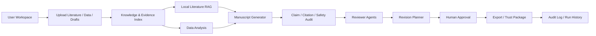

# ResearchAgent

[](https://github.com/onebu123/researchagent-local-mvp/actions/workflows/ci.yml)


ResearchAgent is an auditable all-in-one research agent workspace for literature ingestion, evidence-grounded drafting, claim verification, reviewer simulation, revision planning, and exportable research audit packages.

It is not a paper-writing service and does not fabricate DOI values, authors, years, journals, pages, p-values, statistical significance, causal conclusions, experimental results, or verified references. Demo and mock outputs must remain visibly labeled as demo/mock evidence.

Current version: `v2.0.1-dev`.

Start here:
- [Product vision](docs/product_vision.md)
- [Agent architecture](docs/agent_architecture.md)
- [Roadmap](docs/roadmap.md)
- [Developer agent guide](AGENTS.md)
- [Docs index](docs/README.md)

## What It Does

- Ingests local literature, data, drafts, and project artifacts.
- Builds local evidence and provenance records for claims, passages, figures, analysis outputs, reviewer issues, and exports.
- Provides an offline-first Literature RAG layer for source-passage retrieval.
- Supports evidence-grounded drafting, citation grounding, manuscript safety checks, reviewer simulation, and revision planning.
- Exports project and audit packages with relative paths and sanitized metadata.
- Keeps `LLM_MODE=mock` as the default so tests and demos do not require real API keys or external research services.

## Why It Matters

Research workflows often split literature review, data analysis, drafting, citation checks, and revision tracking across disconnected tools. That makes it easy to lose provenance and hard to audit whether a claim is actually supported. ResearchAgent keeps the workspace organized around evidence, source passages, human review, and explicit limitations.

## Core Workflow

`Upload -> Index -> Analyze -> Draft -> Audit -> Review -> Revise -> Export`

1. Upload literature, data, figures, and manuscript drafts.
2. Index local sources and build evidence records.
3. Analyze available data with provenance and limitations.
4. Draft only from allowed local evidence.
5. Audit claims, citations, safety risks, and traceability.
6. Simulate reviewer issues without pretending they are peer review.
7. Plan revisions with human approval requirements.
8. Export source packages, evidence packages, and trust reports.

## Feature Matrix

| Area | Current status | Integrity rule |
| --- | --- | --- |
| Literature ingestion | Local files and parsed text | Parser quality and metadata status must be explicit |
| Literature RAG | Offline local retrieval | Answers must cite retrieved source passages or mark unsupported |
| Data analysis | Local descriptive analysis | No fabricated p-values, significance, or causal claims |
| Manuscript drafting | Evidence-grounded draft helpers | Demo drafts are not scientific conclusions |
| Claim/citation audit | Local alignment and grounding reports | Verified references require human approval metadata |
| Reviewer simulation | Evidence, citation, statistical, and safety checks | Simulated reviewer output is not peer review |
| Revision planning | Patch suggestions and approval gates | Patches must require human approval where relevant |
| Export | Project/source/evidence packaging | Packages exclude runtime artifacts and secrets |
| Production scaffold | Research Workspace scaffold | Optional PostgreSQL planning only; local defaults remain SQLite/inline |

## Architecture Overview



Backend details live in [docs/agent_architecture.md](docs/agent_architecture.md). The v2 Research Workspace scaffold is documented in [docs/deployment_v2.md](docs/deployment_v2.md).

## Quick Start

Backend:

```bash
cd services/api
python -m pip install -e .
python -m uvicorn main:app --reload --host 127.0.0.1 --port 8000
```

Frontend:

```bash
cd apps/web
npm install
npm run dev -- --hostname 127.0.0.1 --port 3100
```

Open the web app at `http://127.0.0.1:3100`. The API health endpoint is `http://127.0.0.1:8000/health`.

## Demo Commands

```bash
python scripts/seed_demo.py
python scripts/run_demo.py
python scripts/reset_demo.py --yes
```

## Verification Commands

```bash
python -m compileall services/api scripts
python -m pytest services/api/tests -q
python scripts/run_demo.py
python scripts/validate_v2.py
cd apps/web && npm run typecheck
cd apps/web && npm run build
cd apps/web && npx playwright test
```

## Release Packaging

Generate a source package and evidence package:

```bash
python scripts/package_release.py --version v2.0.1-dev --output-dir dist
```

The release packaging scripts normalize zip entries to POSIX `/` paths, exclude runtime artifacts such as `projects/`, `.next/`, `node_modules/`, `__pycache__/`, test reports, and `.env*`, and allow `.env.example`. Evidence logs are sanitized and must not present failed tests or a dirty git status as release-ready.

## Environment Variables

Defaults are local and offline-first:

```bash
APP_ENV=local
PROJECTS_ROOT=./projects
DATABASE_BACKEND=sqlite
QUEUE_MODE=inline
AUTH_MODE=disabled
LLM_MODE=mock
LLM_API_KEY=
NEXT_PUBLIC_API_BASE_URL=http://localhost:8000
```

`QUEUE_MODE=inline` and `AUTH_MODE=disabled` are intentional local defaults. Optional PostgreSQL configuration is documented for future deployment planning, not required for demos or tests.

## Repository Layout

```text
services/api/       FastAPI backend, agent tools, workflow APIs, tests
apps/web/           Next.js command center UI and Playwright tests
scripts/            Demo, validation, release, and evidence utilities
docs/               Architecture, roadmap, guides, and archived reports
.github/            Issue templates, pull request template, and CI
projects/           Local runtime workspace, ignored by git
dist/               Local release output, ignored by git
```

## Safety And Research Integrity

- `LLM_MODE=mock` is the default.
- Tests must not require real API keys, external networks, or external research services.
- Mock/demo outputs must be labeled as such.
- All claim, citation, reviewer, revision, and export outputs must preserve evidence/provenance/audit context.
- Source and evidence packages must not include secrets, local absolute paths, cache directories, runtime databases, or generated project outputs.
- The system does not replace real experiments, statistical review, human citation verification, peer review, or publication decisions.

## Current Limitations

- The repository is still a local-first research workspace, not a hosted production service.
- Literature parsing and retrieval quality depend on local source quality and parser availability.
- Optional live LLM mode requires local configuration and is not used by tests.
- Reviewer agents are simulated guardrails, not formal peer review.
- Export packages are audit handoff artifacts, not compliance certificates.

## Roadmap

See [docs/roadmap.md](docs/roadmap.md) for full goals, deliverables, acceptance criteria, and non-goals.

- `v2.0.1` Quality Fix Release: version consistency, release packaging, evidence chain reliability, CI hygiene.
- `v2.1` Research Agent Loop: auditable Generator -> Reviewer -> Reviser iterations.
- `v2.2` Real Literature RAG: stronger offline retrieval, parser metadata, unsupported-answer detection.
- `v2.3` Evaluation Benchmarks: curated local eval sets and regression reports.
- `v3.0` All-in-one Research Agent Workspace: integrated command center, agent orchestration, and exportable audit packages.

## Contributing

Read [CONTRIBUTING.md](CONTRIBUTING.md) and [AGENTS.md](AGENTS.md) before making changes. Keep pull requests small, auditable, and test-backed.

## License

License: TBD by repository owner.

## Legacy Validation Notes

Historical validation scripts still assert the presence of earlier milestone labels. Those reports are archived under `docs/`; the current repository version remains `v2.0.1-dev`.

- ResearchAgent v1.0 Local MVP: `python scripts/validate_v1.py`
- ResearchAgent v2.0 Research Workspace scaffold: `python scripts/validate_v2.py`
