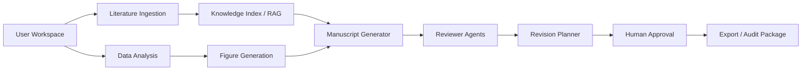

# Agent Architecture

ResearchAgent is moving toward an all-in-one research agent workspace, but the current implementation remains local-first and mock-by-default. This document describes the intended agent responsibilities and the current safety boundary.

## Target Flow

## Agent Responsibilities

| Agent | Inputs | Outputs | Limits |
| --- | --- | --- | --- |
| Literature Ingestion | Uploaded literature and parsed text | Literature index, parser metadata | Does not verify references automatically |
| Knowledge Index / RAG | Local source text and metadata | Chunks, answers, source passages | Offline retrieval; unsupported answers must be labeled |
| Research Question | Topic, literature notes, evidence gaps | Candidate questions | Must not invent findings |
| Data Analysis | Local CSV/data artifacts | Descriptive summaries and provenance | No fabricated p-values or causal conclusions |
| Figure Generation | Local data and analysis outputs | Figures and figure provenance | Figures must keep source-data context |
| Manuscript Generator | Evidence, source passages, analysis, figures | Draft/readable/refined manuscript artifacts | Drafts are not scientific conclusions |
| Evidence Reviewer | Claims, evidence ledger, source passages | Evidence issues and warnings | Cannot convert unsupported claims into verified facts |
| Citation Reviewer | References, source passages, citation reports | Citation grounding issues | Human approval is required for verified references |
| Statistical Reviewer | Analysis provenance and manuscript wording | Statistical overclaim warnings | Does not perform formal statistical review |
| Safety Reviewer | Manuscript and patch text | Safety issues and blocked terms | Guards against overclaims, not full semantic proof |
| Revision Planner | Reviewer issues and current manuscript | Patch suggestions and revision plan | Human approval is required before applying changes |
| Export Agent | Project artifacts and audit data | Source/evidence/workspace packages | Exports are audit handoff artifacts, not certificates |

## Current Implementation

Current backend agents live in `services/api/app/agents/` and are orchestrated by `services/api/app/workflows/research_workflow.py`. The workflow is still mostly linear. Some target roles are represented by tools or panels rather than dedicated agent classes.

Implemented local capabilities include literature indexing, offline RAG, CSV profiling, plotting, evidence ledger generation, manuscript drafting/refinement, claim alignment, reviewer reports, manuscript safety checks, patch planning, audit logs, run history, and export packaging.

Still planned: a clearer `agent_core` contract layer, durable multi-round Generator → Reviewer → Reviser orchestration, stronger RAG evaluation, and richer human approval workflows.

## Mock/Offline Vs Live LLM

- `LLM_MODE=mock` is the default and is used by tests and demos.
- Live LLM mode is optional and must be configured locally.
- Tests must not require real API keys or external networks.
- Live output must still preserve evidence, provenance, limitations, and audit context.

## Non-Goals

- No production-ready claim.
- No peer-review-ready claim.
- No compliance-ready claim.
- No fabricated DOI, authors, years, journals, pages, p-values, significance, causality, or experimental conclusions.
