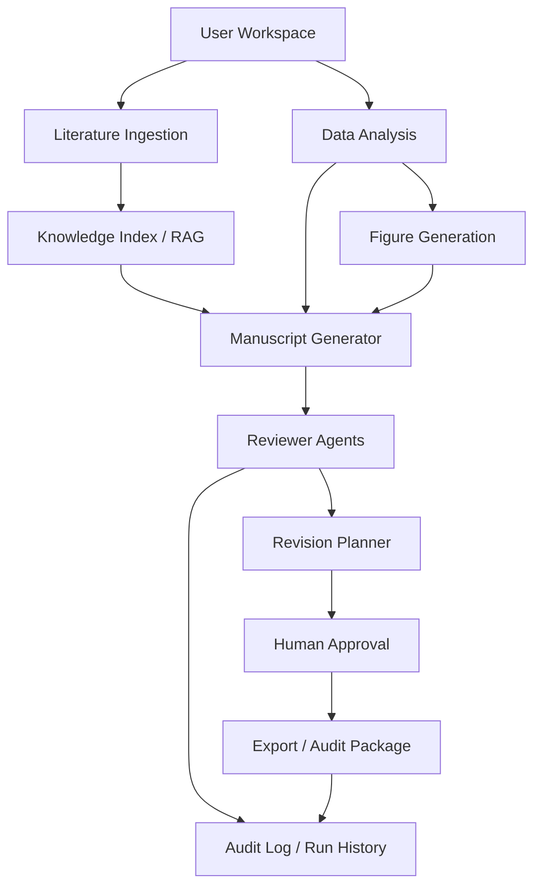

# All-in-one Agent Architecture

ResearchAgent is organized around a local user workspace, explicit artifacts, and auditable agent responsibilities. The current implementation is still local-first and mock-by-default; this document describes the intended skeleton and extension boundaries.



## Agent Responsibilities

| Agent | Inputs | Outputs | Limits |
| --- | --- | --- | --- |
| Literature Ingestion | Local PDFs/text and metadata | Parsed text, parser metadata, literature index | Does not verify DOI or metadata without explicit human/provider evidence |
| Knowledge Index / RAG | Parsed literature and chunks | Source passages, retrieval scores, unsupported notes | Offline retrieval only unless optional adapters are configured |
| Data Analysis | Local CSV and analysis artifacts | Descriptive summaries and provenance | Does not fabricate inferential statistics or causal conclusions |
| Figure Generation | Analysis outputs and provenance | Figure files and figure provenance | Demo figures are not experimental proof |
| Manuscript Generator | Source passages, allowed claims, analysis summaries | Draft artifacts and generation notes | Must distinguish supported and unsupported claims |
| Reviewer Agents | Drafts, claims, references, source passages | Blocking issues, warnings, suggested fixes | Simulated reviewers are not formal peer review |
| Revision Planner | Reviewer issues and current drafts | Revision plans and patch suggestions | Patches must require human approval where relevant |
| Human Approval | Revision plans and reviewed artifacts | Approved decisions and audit events | Human review is required for verified references and final claims |
| Export / Audit Package | Project artifacts and audit log | Source package, evidence package, trust report | Packages must exclude runtime artifacts, secrets, and absolute paths |

## Mock/Offline vs Live LLM

- Mock/offline mode is the default and must be deterministic enough for tests.
- Live LLM mode is optional and must be explicitly configured outside tests.
- Feature code should use the configured LLM client rather than forcing mock mode.
- Live output still needs evidence grounding, limitations, and audit records.
- A future optional LangGraph adapter may orchestrate agents, but LangGraph is not a required dependency.

## Artifact Contract

Agent outputs should be written under project-relative paths such as:

```text
agent/agent_plan.json
agent/research_loop_runs.jsonl
agent/reviewer_rounds.jsonl
agent/revision_plan.json
literature/rag/chunks.jsonl
literature/rag/rag_answers.jsonl
manuscript/draft.md
exports/
```

Generated records should include the producing step, input artifact references, output artifact references, timestamp, limitations, and whether human approval is required.
