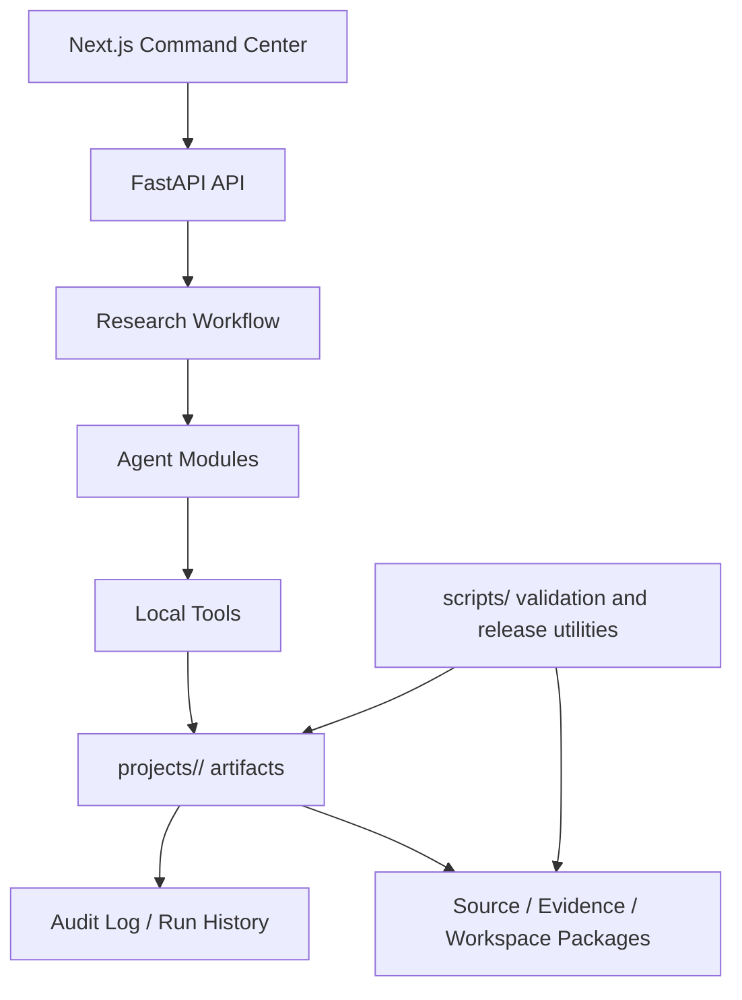

# Architecture

ResearchAgent is a local-first workspace built around explicit artifacts and audit trails. The current system is designed to run in mock/offline mode by default and to preserve provenance rather than hide uncertainty behind generated text.

## System Map

## Backend

- `services/api/main.py` exposes the FastAPI application and health/version endpoint.
- `services/api/app/api/` contains project, upload, workflow, literature, manuscript, review, trust, export, and system routers.
- `services/api/app/agents/` contains the current linear workflow agents.
- `services/api/app/tools/` contains local tools for parsing, RAG, analysis, plotting, evidence, claim/citation checks, safety checks, patches, exports, audit logs, and run history.
- `services/api/app/workflows/` runs the current local workflow.
- `services/api/tests/` contains regression and milestone tests.

## Frontend

- `apps/web/app/page.tsx` should stay thin and render the workspace home.
- `apps/web/features/workspace/` contains the command center, stepper, data hook, advanced panels, and legacy workspace wrapper.
- `apps/web/components/` contains focused panels for literature, evidence, analysis, manuscript, review, trust, and export.
- `apps/web/lib/api.ts` remains a compatibility re-export for the split API client modules.
- `apps/web/e2e/` contains Playwright coverage for the command center and legacy workflows.

## Artifact Model

Runtime artifacts live under `projects/<project_id>/` and are ignored by git. Important artifact classes include:

- literature indexes and RAG chunks/answers
- analysis summaries and provenance
- figure provenance
- evidence claims and claim alignment
- manuscript drafts, readable/refined drafts, patches, and diffs
- review reports and sentence issues
- audit logs and run history
- export and trust-report packages

Artifacts should use project-relative paths and should not contain secrets or local absolute paths.

## Verification And Release

- `python scripts/verify_local.py` runs local backend, demo, frontend, artifact, safety, and release checks.
- `python scripts/validate_v2.py` preserves the current v2 scaffold validation chain.
- `python scripts/package_release.py --version v3.0.0-rc1 --output-dir dist` creates source and evidence packages.
- `python scripts/check_secrets_static.py` scans for common secret patterns.

Release packages must exclude runtime artifacts such as `projects/`, `dist/`, `.next/`, `node_modules/`, caches, Playwright reports, and `.env*` while allowing `.env.example`.

## Safety Boundary

ResearchAgent currently provides local guardrails and audit artifacts. It does not certify scientific truth, production readiness, compliance readiness, or peer review readiness.
